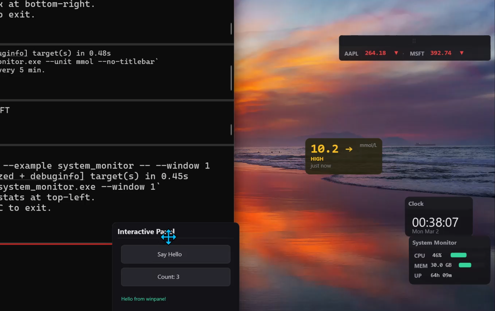

# winpane

Create transparent floating overlays on Windows — stats HUDs, interactive panels, PiP thumbnails, tray icons. Rust core, usable from TypeScript, Python, C, Go, Zig.



## Demo

<video src="https://github.com/user-attachments/assets/dc0ef4b6-7683-408f-b6c8-db81ac34a941" controls muted width="720" title="winpane overlays demo"></video>

## Try it

Examples are draggable, remember their position, and default to the bottom-right corner. Most support `--no-titlebar`, `--position X,Y`, `--monitor N`, and more — run any example with `--help` to see its flags.

```sh
cargo run -p winpane --example clock_overlay
cargo run -p winpane --example countdown_timer
cargo run -p winpane --example system_monitor -- --no-titlebar
cargo run -p winpane --example stock_ticker -- --monitor 1
cargo run -p winpane --example glucose_monitor -- --demo --unit mmol --no-titlebar
cargo run -p winpane --example capture_excluded -- --position 100,100

# see all flags for any example
cargo run -p winpane --example clock_overlay -- --help
```

`pip_viewer` and `anchored_companion` look for an open Notepad or Calculator window. All examples run without configuration — network-dependent ones fall back to simulated data.

<details>
<summary>All examples</summary>

### Rust

| Example | What it does |
|---------|-------------|
| [`clock_overlay`](examples/rust/clock_overlay.rs) | Live desktop clock, updates every second |
| [`glucose_monitor`](examples/rust/glucose_monitor.rs) | CGM overlay — polls Nightscout or uses simulated data |
| [`stock_ticker`](examples/rust/stock_ticker.rs) | Stock prices with live/simulated data |
| [`countdown_timer`](examples/rust/countdown_timer.rs) | Interactive timer with Start/Reset buttons |
| [`system_monitor`](examples/rust/system_monitor.rs) | Real CPU and memory usage |
| [`color_picker`](examples/rust/color_picker.rs) | Pixel color under cursor, updated live |
| [`sticky_notes`](examples/rust/sticky_notes.rs) | Floating notes, toggled via tray icon |
| [`interactive_panel`](examples/rust/interactive_panel.rs) | Clickable buttons, hover effects, drag |
| [`tray_ticker`](examples/rust/tray_ticker.rs) | System tray icon with popup panel |
| [`pip_viewer`](examples/rust/pip_viewer.rs) | Live thumbnail of another window |
| [`anchored_companion`](examples/rust/anchored_companion.rs) | Panel that follows another window |
| [`hud_demo`](examples/rust/hud_demo.rs) | Basic stats overlay |
| [`backdrop_demo`](examples/rust/backdrop_demo.rs) | Mica / Acrylic backdrop effects (Win11) |
| [`fade_demo`](examples/rust/fade_demo.rs) | Fade-in / fade-out animations |
| [`capture_excluded`](examples/rust/capture_excluded.rs) | Overlay hidden from screen capture |
| [`custom_draw`](examples/rust/custom_draw.rs) | Procedural D2D drawing |

Run any Rust example: `cargo run -p winpane --example <name>`. Some examples may be buggy, please report issues, contributions welcome!

### TypeScript

[`examples/typescript/`](examples/typescript/): [`clock_overlay.ts`](examples/typescript/clock_overlay.ts), [`glucose_monitor.ts`](examples/typescript/glucose_monitor.ts), [`pomodoro.ts`](examples/typescript/pomodoro.ts), [`sticky_notes.ts`](examples/typescript/sticky_notes.ts), [`stock_ticker.ts`](examples/typescript/stock_ticker.ts)

Run: `npx tsx examples/typescript/<name>.ts` (requires addon built; see [TypeScript guide](docs/guides/typescript.md))

### Python (JSON-RPC)

[`examples/python/`](examples/python/): [`clock_overlay.py`](examples/python/clock_overlay.py), [`glucose_monitor.py`](examples/python/glucose_monitor.py), [`hud_demo.py`](examples/python/hud_demo.py)

Run: `python examples/python/<name>.py` (requires `winpane-host` built; see [Python guide](docs/guides/python.md))

### Node.js

[`examples/node/`](examples/node/): [`backdrop_demo.js`](examples/node/backdrop_demo.js), [`hud_demo.js`](examples/node/hud_demo.js), [`interactive_panel.js`](examples/node/interactive_panel.js)

Run: `node examples/node/<name>.js` (requires addon built; see [Node.js guide](docs/guides/nodejs.md))

### C

[`examples/c/`](examples/c/): [`custom_draw.c`](examples/c/custom_draw.c), [`hello_hud.c`](examples/c/hello_hud.c)

See [`build.bat`](examples/c/build.bat) or [`CMakeLists.txt`](examples/c/CMakeLists.txt) for build instructions.

</details>

## What it does

- Transparent always-on-top windows via DirectComposition — no GDI, no process injection
- GPU-accelerated rendering: D3D11 → DXGI swap chain → D2D device context → DirectComposition visual
- Retained-mode scene graph — add rects, text, images; winpane handles the draw loop
- Multi-language: Rust API, Node.js addon (napi-rs), C ABI (cbindgen), JSON-RPC CLI for Python/Go/Zig/anything
- Built-in DPI awareness, capture exclusion, Mica/Acrylic backdrops, fade animations, system tray, drag, hit testing

## What it does NOT

**Not a UI framework.** No layout engine, no CSS, no widgets. You position elements with x/y coordinates.

**Not cross-platform.** Windows only, by design. Uses DirectComposition, which has no equivalent on other operating systems.

**Not a game render-loop hook.** DirectComposition composites outside the game process, adding 1–3 ms. Fine for MMO dashboards, strategy game tools, or any overlay where a couple of milliseconds don't matter. Competitive twitch shooters that need sub-frame precision typically inject into the render pipeline instead.

## Surface types

| Type | Behavior | Use case |
|------|----------|----------|
| **Hud** | Click-through, topmost, no taskbar entry | Stats overlays, notifications, timers |
| **Panel** | Interactive — hit testing, click/hover events, drag | Tool palettes, floating controls, popups |
| **Pip** | Live DWM thumbnail of another window | Preview panels, reference windows |
| **Tray** | System tray icon with popup panel and context menu | Background app controls, status indicators |

These compose together — a tray icon can toggle a panel, a panel can anchor to another window, any surface can fade and exclude itself from screenshots.

## Install

### Rust

```sh
cargo add winpane
```

### Node.js / Bun

```sh
npm install winpane
```

Or [build from source](docs/guides/nodejs.md).

### C / C++

Link against `winpane_ffi.dll` and include `winpane.h` (generated by cbindgen). Build the DLL:

```sh
cargo build -p winpane-ffi --release
```

### Any language

Spawn the `winpane-host` CLI binary, talk JSON-RPC 2.0 over stdin/stdout. Build:

```sh
cargo build -p winpane-host --release
```

## Quick start

```typescript
import { WinPane } from "winpane";

const wp = new WinPane();
const hud = wp.createHud({ width: 300, height: 100, x: 100, y: 100 });

wp.setRect(hud, "bg", {
  x: 0, y: 0, width: 300, height: 100,
  fill: "#14141ec8", cornerRadius: 8,
});
wp.setText(hud, "msg", {
  text: "Hello from winpane",
  x: 16, y: 16, fontSize: 18,
});
wp.show(hud);
```

This creates a transparent, click-through overlay at (100, 100) with a rounded dark background and white text. The surface stays on top of all windows, invisible to screen capture if you want it to be.

If building from source, see the [TypeScript guide](docs/guides/typescript.md).

## Guides

- [Rust](docs/guides/rust.md)
- [Node.js](docs/guides/nodejs.md)
- [TypeScript / JavaScript](docs/guides/typescript.md)
- [C / C++](docs/guides/c.md)
- [Go](docs/guides/go.md)
- [Zig](docs/guides/zig.md)
- [Python / any language](docs/guides/python.md) (JSON-RPC)
- [Cookbook](docs/cookbook.md) — 10 self-contained recipes

## Reference

- [Design overview](docs/design.md) — architecture, key decisions
- [JSON-RPC protocol](docs/protocol.md) — full method reference for `winpane-host`
- [Limitations](docs/limitations.md) — known constraints and workarounds
- [Signing and distribution](docs/signing.md) — code signing, SmartScreen, MSIX

## Platform

- Windows 10 version 1903 or later
- Windows 11 22H2+ for backdrop effects (Mica, Acrylic)
- Windows 10 2004+ for capture exclusion

## Status

**Pre-1.0.** The API works and examples run, but expect breaking changes. Bug reports and feedback welcome.

## Why I built this

I was diagnosed with Type 1 diabetes in 2025. Most CGM apps are geolocked and unavailable in Kenya, so I built [mysukari.com](https://mysukari.com) — a free platform that connects any CGM via Nightscout for reporting and analysis. I wanted a small desktop overlay showing my glucose reading and trend arrow, updating every few minutes, hidden from screen shares. Nothing lightweight and multi-language existed, so I built winpane.

I had no prior experience with DirectComposition, Direct2D, or Win32 GPU rendering. [GitHub Copilot](https://github.com/features/copilot) with Claude Opus 4.6 was instrumental in building this.

## License

MIT
